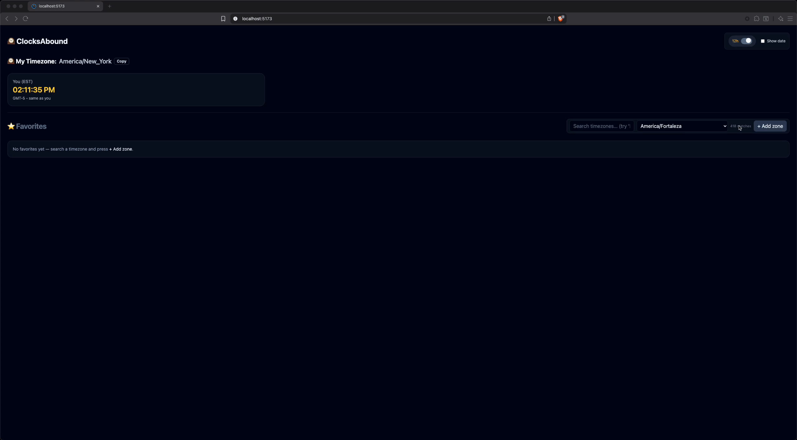

# 🕰️ ClocksAbound

_A raccoon-approved dashboard for global domination — one time zone at a time._ 🦝

[](https://github.com/NickTheDevOpsGuy/ClocksAbound/actions/workflows/ci-file.yml)


---

## 🖼 Preview

### Main App Demo


### Feature Highlights


> 🎞️ *Previews are short animated GIFs recorded directly from the live app using screen capture — perfect for quick demos in READMEs.*

---

## 🚀 Features

- 🌍 **Global Timezone Dashboard** — view live clocks for cities around the world, updating in real time.  
- ⭐ **Favorites List** — pin and organize your most important time zones for quick access.  
- 🕹️ **Interactive Zone Picker** — easily add or remove time zones using a searchable dropdown.  
- 💾 **Local Storage Sync** — your favorite clocks persist between sessions automatically.  
- 🌓 **Light & Dark Mode** — designed with accessibility and contrast in mind.  
- ⚡ **Built with React + TypeScript** — modern, fast, and clean architecture.  
- 🎨 **Beautiful UI** — minimal, responsive design with subtle animations for a calm dashboard feel.

---

## 🛣️ Roadmap

Planned features and improvements for upcoming versions:

- [x] Real-time multi-zone clock display  
- [x] Favorites list with local storage persistence  
- [ ] Timezone search and quick add functionality  
- [ ] 12h / 24h time format toggle  
- [ ] Display UTC offset and local differences  
- [ ] Reorder favorite clocks via drag-and-drop  
- [ ] Optional weather or date display per zone  
- [ ] Export / share your clock layout  
- [ ] PWA support for installable desktop experience  

💡 *Have an idea or feature request? Open an issue or discussion — feedback is always welcome!*

---

## 🧱 Tech Stack

ClocksAbound is built with a modern, minimal React setup focused on performance and simplicity.

| Category | Technologies |
|-----------|---------------|
| 🖥️ Frontend | [React](https://react.dev/) + [TypeScript](https://www.typescriptlang.org/) |
| ⚡ Bundler | [Vite](https://vitejs.dev/) |
| 💅 Styling | [Tailwind CSS](https://tailwindcss.com/) |
| 🧩 State & Hooks | React Hooks + Local Storage |
| 🌙 Theme | Light / Dark mode with accessible contrast |
| 🧭 Date & Time | [Intl.DateTimeFormat](https://developer.mozilla.org/en-US/docs/Web/JavaScript/Reference/Global_Objects/Intl/DateTimeFormat) API |
| 🧰 Tooling | ESLint • Prettier • pnpm / npm |

---

🧡 *Designed to be fast, accessible, and easy to extend — a playground for both design and logic.*

---

## 📦 Getting Started

1. **Clone the repository**

   ```bash
   git clone https://github.com/NickTheDevOpsGuy/ClocksAbound.git
   ```

2. **Install dependencies**

   ```bash
   npm i
   ```

3. **Run the development server**

   ```bash
   npm run dev
   ```
---

## 📂 Project Structure

<details>
<summary>📁 Click to expand file structure</summary>

```plaintext
.
├── .github
│   ├── ISSUE_TEMPLATE
│   │   ├── bug.yml
│   │   ├── config.yml
│   │   ├── documentation.yml
│   │   ├── enhancement_refactor.yml
│   │   ├── feature_request.yml
│   │   └── question_discussion.yml
│   ├── pull_request_template.md
│   └── workflows
│       └── ClocksAbound.yml
├── .gitignore
├── .husky
│   ├── pre-commit
│   └── pre-push
├── .prettierignore
├── .prettierrc
├── .prettierrc.json
├── .prettierrc.yml
├── .stylelintrc.json
├── App.tsx
├── index.html
├── LICENSE
├── main.tsx
├── package.json
├── README.md
├── src
│   └── app
│       ├── components
│       │   ├── Clock.tsx
│       │   └── ZonePicker.tsx
│       ├── hooks
│       │   └── useLocalStorage.ts
│       ├── lib
│       │   └── timezones.ts
│       └── styles
│           └── global.css
├── tsconfig.app.json
├── tsconfig.json
├── tsconfig.node.json
├── vite-env.d.ts
└── vite.config.ts
```
</details>

---

## 🤝 Contributing

- 🐛 Report bugs in [Issues](../../../../issues)
- 💡 Suggest features or improvements
- 🔧 Open a Pull Request

---

## 🦝 Built by NickDoesDevOps

Created with ☕, curiosity, and a touch of chaos by [Nicholas Clark](https://www.linkedin.com/in/nickdoesdevops).  
Follow the journey → [GitHub](https://github.com/NickTheDevOpsGuy) • [LinkedIn](https://www.linkedin.com/in/nickdoesdevops)

🏷 #NickDoesDevOps • #LearningInPublic • #BuiltInPublic